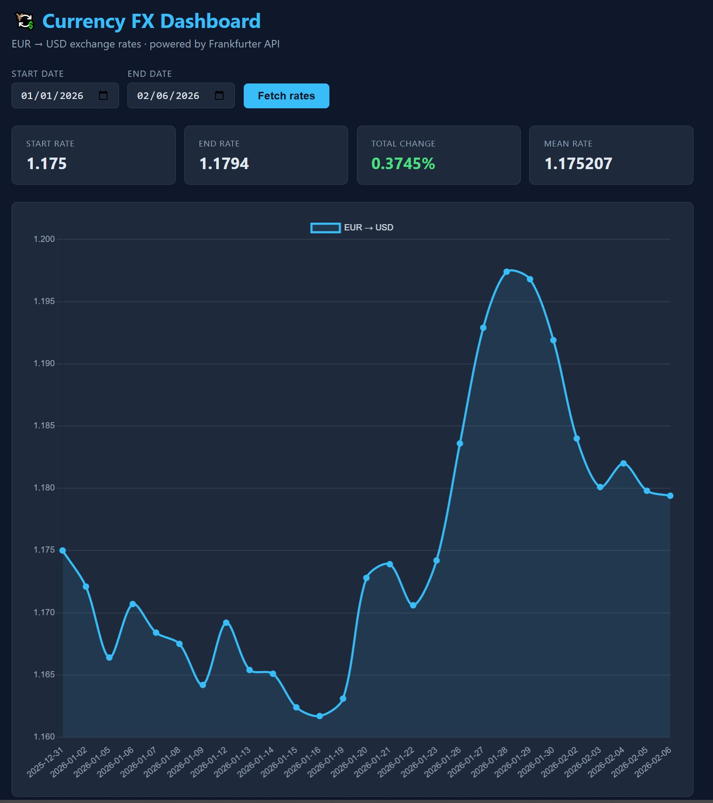

# Currency FX Summary

andiron-cursor :white_check_mark:

> Coins alone do not tell the story — this app shows you the pattern and the change. 🍍

A Python application combining **Django** (web dashboard) and **FastAPI** (REST API) to fetch EUR → USD exchange rates from the [Frankfurter API](https://frankfurter.dev/), compute day-by-day percentage changes, and present summary statistics.

---

## Features

- **FastAPI REST API** at `/api/health` and `/api/summary`
- **Django Dashboard** at `/` with interactive Chart.js chart and data table
- **Frankfurter API** integration (no API key required)
- **Automatic fallback** to local `data/sample_fx.json` on network failure
- **Resilience**: retry with exponential backoff (tenacity), in-memory TTL cache (cachetools), rate limiting (slowapi)
- **Division-by-zero guard** in percentage calculations
- Day-by-day breakdown or totals-only mode

## Quick Start

```bash
# 1. Create a virtual environment (optional but recommended)
python -m venv .venv
.venv\Scripts\activate        # Windows
# source .venv/bin/activate   # macOS / Linux

# 2. Install dependencies
pip install -r requirements.txt

# 3. Run on port 8000
uvicorn currency_project.asgi:application --host 0.0.0.0 --port 8000
```

Then open:
- **Dashboard**: [http://localhost:8000/](http://localhost:8000/)
- **API docs** (Swagger): [http://localhost:8000/api/docs](http://localhost:8000/api/docs)

## API Endpoints

### `GET /api/health`

Liveness probe.

```bash
curl http://localhost:8000/api/health
```

```json
{
  "status": "ok",
  "pineapple": "🍍"
}
```

### `GET /api/summary`

Returns FX summary for EUR → USD.

| Parameter    | Type   | Required | Default | Description                                |
|-------------|--------|----------|---------|--------------------------------------------|
| `start_date` | string | yes      | —       | Start date (`YYYY-MM-DD`)                  |
| `end_date`   | string | yes      | —       | End date (`YYYY-MM-DD`)                    |
| `breakdown`  | string | no       | `day`   | `day` for daily records, `none` for totals |

**Example — day-by-day breakdown:**

```bash
curl "http://localhost:8000/api/summary?start_date=2025-01-02&end_date=2025-01-10&breakdown=day"
```

```json
{
  "base": "EUR",
  "target": "USD",
  "start_date": "2025-01-02",
  "end_date": "2025-01-10",
  "breakdown": "day",
  "days": [
    { "date": "2025-01-02", "rate": 1.0352, "pct_change": null },
    { "date": "2025-01-03", "rate": 1.0292, "pct_change": -0.5797 },
    { "date": "2025-01-06", "rate": 1.0382, "pct_change": 0.8745 },
    { "date": "2025-01-07", "rate": 1.0354, "pct_change": -0.2697 },
    { "date": "2025-01-08", "rate": 1.0318, "pct_change": -0.3476 },
    { "date": "2025-01-09", "rate": 1.0299, "pct_change": -0.1842 },
    { "date": "2025-01-10", "rate": 1.025,  "pct_change": -0.4758 }
  ],
  "totals": {
    "start_rate": 1.0352,
    "end_rate": 1.025,
    "total_pct_change": -0.9854,
    "mean_rate": 1.032100
  }
}
```

**Example — totals only:**

```bash
curl "http://localhost:8000/api/summary?start_date=2025-01-02&end_date=2025-01-10&breakdown=none"
```

```json
{
  "base": "EUR",
  "target": "USD",
  "start_date": "2025-01-02",
  "end_date": "2025-01-10",
  "breakdown": "none",
  "days": null,
  "totals": {
    "start_rate": 1.0352,
    "end_rate": 1.025,
    "total_pct_change": -0.9854,
    "mean_rate": 1.032100
  }
}
```

## Project Structure

```
currency/
├── manage.py                          # Django management
├── requirements.txt                   # Python dependencies
├── README.md
├── data/
│   └── sample_fx.json                 # Fallback FX data
├── core/
│   ├── __init__.py
│   ├── fx_service.py                  # Fetch, retry, cache, fallback, calculations
│   └── schemas.py                     # Pydantic models
├── fastapi_app/
│   ├── __init__.py
│   └── main.py                        # /api/health & /api/summary
├── currency_project/
│   ├── __init__.py
│   ├── settings.py                    # Django settings
│   ├── urls.py                        # Django URL config
│   ├── wsgi.py
│   └── asgi.py                        # ASGI router (Django + FastAPI)
└── dashboard/
    ├── __init__.py
    ├── views.py                       # Django dashboard view
    ├── urls.py
    └── templates/dashboard/
        └── index.html                 # Chart.js + table UI
```

## Resilience

| Shield         | Implementation                                      |
|---------------|------------------------------------------------------|
| **Retry**      | tenacity — 3 attempts with exponential backoff       |
| **Cache**      | cachetools TTLCache — 256 entries, 15-min TTL        |
| **Rate limit** | slowapi — 30 req/min on `/api/summary`, 60 on health |
| **Fallback**   | Local `data/sample_fx.json` on any network failure   |

## Frankfurter API

This project uses the [Frankfurter API](https://frankfurter.dev/) — a free, open-source currency data API tracking ECB reference rates. No API key or sign-up required.

Correct endpoint format:
```
https://api.frankfurter.dev/v1/{start_date}..{end_date}?base=EUR&symbols=USD
```

> **Note:** The task description used `from` and `to` parameters — the actual API uses `base` and `symbols`.

---

🍍 *Left by the door.*
